# Лабораторная работа 1
## Задание 1
# Привет и возраст
```
name = input("Имя: ")
age = int(input("Возраст: "))
print(f"Привет, {name}! Через год тебе будет {age + 1}.")
```
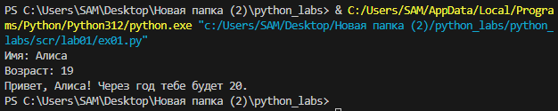


## Задание 2
# Сумма и среднее
```
a_ = input("a: ").replace(",", ".")
b_ = input("b: ").replace(",", ".")
a,b = float(a_),float(b_)
s = round(a+b, 2)
a = round((a+b)/2, 2)
print(f"sum={s}; avg={a}")
```
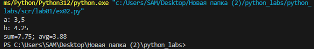

## Задание 3
# Чек: скидка и НДС
```
price = float(input().replace(',', '.'))
discount = float(input().replace(',', '.'))
vat = float(input().replace(',', '.'))
base = price * (1 - discount/100)
vat_amount = base * (vat/100)
total = base + vat_amount
print(f"База после скидки: {base:.2f} ₽")
print(f"НДС: {vat_amount:.2f} ₽")
print(f"Итого к оплате: {total:.2f} ₽")
```
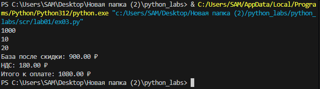

## Задание 4
# Минуты → ЧЧ:ММ
```
m = int(input("Минуты: "))
hour = m // 60
minut = m % 60
print(f"{hour}:{minut:02d}")
```
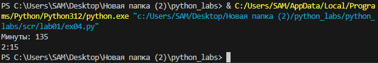

## Задание 5
# Инициалы и длина строки
```
fio_ = input("ФИО: ")
fio = ' '.join(fio_.split())
inicial = ''.join([x[0].upper() for x in fio.split()])
print("Инициалы:", inicial)
print("Длина:", len(fio))
```
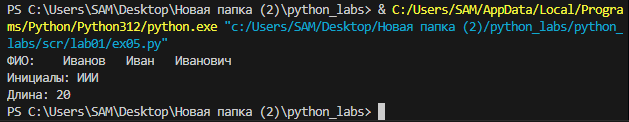

## Задание 6
```
n = int(input())
k_off, k_on = 0,0
for i in range(n):
    s = input().split()
    f = s[-1]
    if f == "True":
        k_off += 1
    else:
        k_on += 1
print(f"{k_off} {k_on}")
```
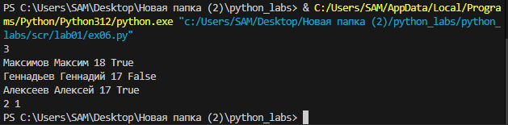


# Лабораторная работа 2

## Задание A
# Массивы
```
# Задание А
def min_max(nums: list[float | int]) -> tuple[float | int, float | int]:
    if not nums:
        return "ValueError"
    return (min(nums), max(nums))

def unique_sorted(nums: list[float | int]) -> list[float | int]:
    return sorted(set(nums))

def flatten(mat: list[list | tuple]) -> list:
    R = []
    for i in mat:
        if not isinstance(i, (list, tuple)):
            return "TypeError"  
        R.append(i)
    return R

print("Тесты min_max:")
print(min_max([3, -1, 5, 5, 0]))    
print(min_max([42]))                
print(min_max([-5, -2, -9]))      
print(min_max([1.5, 2, 2.0, -3.1]))
print(min_max([]))                  

print("Тесты unique_sorted:")
print(unique_sorted([3, 1, 2, 1, 3]))        
print(unique_sorted([]))                    
print(unique_sorted([-1, -1, 0, 2, 2]))      
print(unique_sorted([1.0, 1, 2.5, 2.5, 0]))  

print("Тесты flatten:")
print(flatten([[1, 2], [3, 4]]))       
print(flatten([[1, 2], [3, 4, 5]]))  
print(flatten([[1], [], [2, 3]]))      
print(flatten([[1, 2], "ab"]))   
```
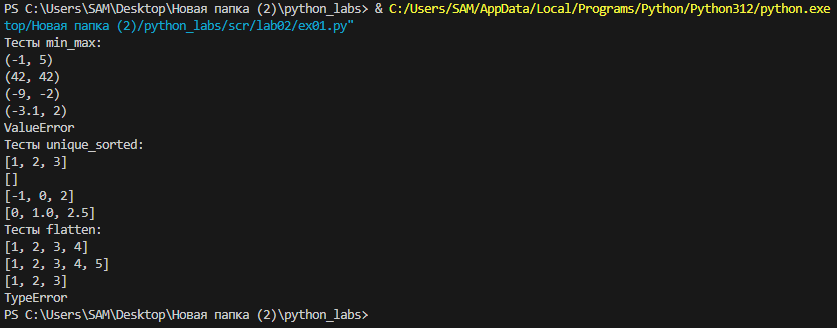

## Задание B
# Матрицы
```
#Задание B
def transpose(mat: list[list[float | int]]) -> list[list]:
    if not mat:
        return [] # если матрица пустая
    for i in mat:
        if len(i) != len(mat[0]): 
            return "ValueError" # если строки разной длины
    R = []
    for i in range(len(mat[0])): # проходим по всем столбцам
        N = []
        for j in range(len(mat)): # проходим по всем строкам
            N.append(mat[j][i])
        R.append(N)
    return R

def row_sums(mat: list[list[float | int]]) -> list[float]:
    if not mat:
        return []
    for i in mat:
        if len(i) != len(mat[0]):
            return "ValueError"
    return [sum(i) for i in mat]

def col_sums(mat: list[list[float | int]]) -> list[float]:
    if not mat:
        return []
    for i in mat:
        if len(i) != len(mat[0]):
            return "ValueError"
    return [sum(mat[i][j] for i in range(len(mat))) for j in range(len(mat[0]))]

print("Тесты transpose:")
print(transpose([[1, 2, 3]])) 
print(transpose([[1], [2], [3]]))  
print(transpose([[1, 2], [3, 4]]))  
print(transpose([]))  
print(transpose([[1, 2], [3]]))  

print("Тесты row_sums:")
print(row_sums([[1, 2, 3], [4, 5, 6]]))  
print(row_sums([[-1, 1], [10, -10]]))  
print(row_sums([[0, 0], [0, 0]]))  
print(row_sums([[1, 2], [3]]))  

print("Тесты col_sums:")
print(col_sums([[1, 2, 3], [4, 5, 6]]))  
print(col_sums([[-1, 1], [10, -10]]))  
print(col_sums([[0, 0], [0, 0]]))
print(col_sums([[1, 2], [3]])) 
```
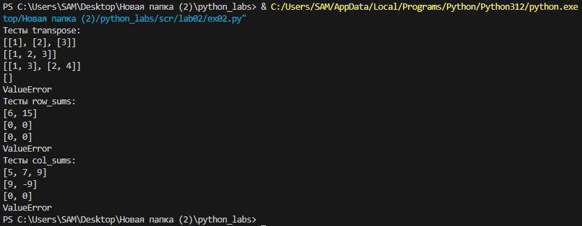

## Задание C
# Кортежи
```
# Задание C
def format_record(rec: tuple[str, str, float]) -> str:
    fio, group, gpa = rec
    group_ = group.strip()
    parts = (fio.strip().title()).split() # убираем лишнии пробелы, изменяем регист и разбиваем на части
    # инициалы
    if len(parts) < 2:  # если только фамилия - возвращаем только фамилию
        inicial = ""
    elif len(parts) == 2:  # фамилия + имя
        inicial = f"{parts[1][0]}."
    else:   # фамилия + имя + отчество
        inicial = f"{parts[1][0]}.{parts[2][0]}."
    # полное имя с инициалами
    name = f"{parts[0]} {inicial}" if inicial else parts[0]
    gpa_ = f"{gpa:.2f}" # gpa с двуми знаками после запятой
    return f"{name}, гр. {group_}, GPA {gpa_}"

print(format_record(("Иванов Иван Иванович", "ВIVT-25", 4.6)))
print(format_record(("Петров Пётр", "IKBO-12", 5.0)))
print(format_record(("Петров Пётр Петрович", "IKBO-12", 5.0)))
print(format_record((" сидорова вина сергеевна ", "ABB-01", 3.999)))
```
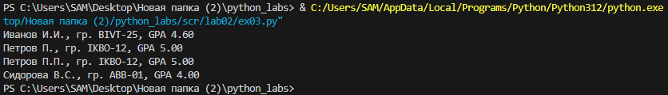

# Лабораторная работа 3
## Задание 1

```
import re
from collections import Counter
def normalize(text: str, *, casefold: bool = True, yo2e: bool = True) -> str:
    text = re.sub(r'\s', ' ', text).strip()
    text = text.casefold()
    text = text.replace('ё', 'е').replace('Ё', 'Е')
    return text

def tokenize(text: str) -> list[str]:
    return re.findall(r'\w+(?:-\w+)*', text)

def count_freq(tokens: list[str]) -> dict[str, int]:
    return dict(Counter(tokens))

def top_n(freq: dict[str, int], n: int = 5) -> list[tuple[str, int]]:
    return sorted(freq.items(), key=lambda x: (-x[1], x[0]))[:n]

print("Тесты normalize")
print(normalize("ПрИвЕт\nМИр\t"))
print(normalize("Ёжик, Ёлка"))

print("\nТесты tokenize")
print(tokenize("привет, мир!"))
print(tokenize("по-настоящему круто"))
print(tokenize("2025 год"))

print("\nТесты count_freq + top_n")
freq = count_freq(["a", "b", "a", "c", "b", "a"])
print(top_n(freq, 2))

print("\nТест тай-брейка")
freq2 = count_freq(["bb", "aa", "bb", "aa", "cc"])
print(top_n(freq2, 2))
```
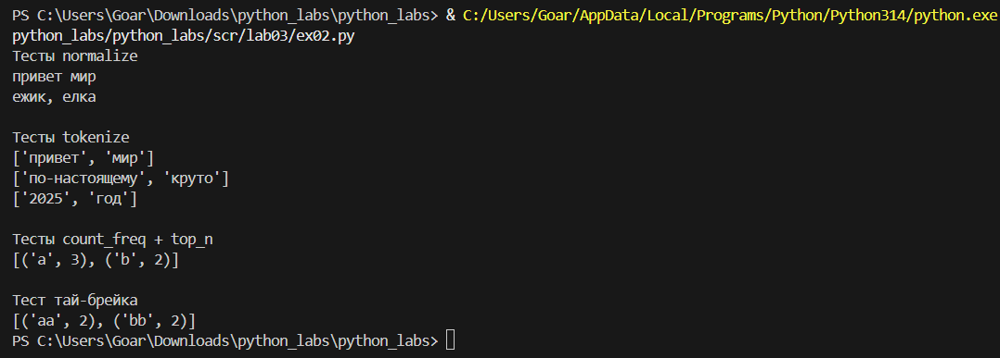

## Задание 2

```
import sys
import os
# путь к папке lib
current_dir = os.path.dirname(__file__)
lib_path = os.path.join(current_dir, '..', '..', 'lib')
sys.path.append(lib_path)
from text import normalize, top_n, tokenize, count_freq
text = sys.stdin.read()
words = tokenize(normalize(text))
freq = count_freq(words)
top = top_n(freq, 5)
print(f'Всего слов: {len(words)}')
print(f'Уникальных слов: {len(freq)}')
print('Топ-5:')
for word, count in top:
    print(f'{word}:{count}')
```
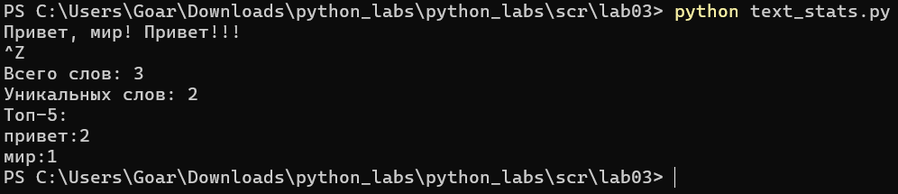


# Лабораторная работа 4 — Файлы
## Задание A

```
import csv
import os
from typing import Iterable, Sequence

def read_text(path: str, encoding: str = "utf-8") -> str:
    with open(path, 'r', encoding=encoding) as file:
        content = file.read()
    return content

def write_csv(rows: Iterable[Sequence], path: str,
              header: tuple[str, ...] | None = None) -> None:
    # Создаем папку если нет
    os.makedirs(os.path.dirname(path), exist_ok=True)
    
    rows = list(rows)
    with open(path, "w", newline="", encoding="utf-8") as f:
        w = csv.writer(f)
        if header is not None:
            w.writerow(header)
        for r in rows:
            w.writerow(r)

if __name__ == "__main__":
    txt = read_text("data/lab04/input.txt")
    write_csv([("word", "count"), ("test", 3)], "data/lab04/check.csv")
```
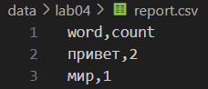
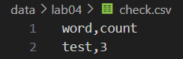

## Задание B

```
from collections import Counter
from io_txt_csv import read_text, write_csv
import sys
import os

# Добавляем путь к папке src
sys.path.append(os.path.join(os.path.dirname(__file__), '..'))

from lib.text import normalize, tokenize

def frequencies_from_text(text: str) -> dict[str, int]:
    tokens = tokenize(normalize(text))
    return Counter(tokens)

def sorted_word_counts(freq: dict[str, int]) -> list[tuple[str, int]]:
    return sorted(freq.items(), key=lambda kv: (-kv[1], kv[0]))

text = read_text("data/lab04/input.txt", encoding="utf-8")
freq = frequencies_from_text(text)
sorted_counts = sorted_word_counts(freq)

write_csv(sorted_counts, "data/lab04/report.csv", header=("word", "count"))

total_words = sum(freq.values())
unique_words = len(freq)

print(f"Всего слов: {total_words}")
print(f"Уникальных слов: {unique_words}")
print("Топ-5:")
for word, count in sorted_counts[:5]:
    print(f"  {word}: {count}")
```
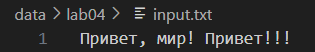
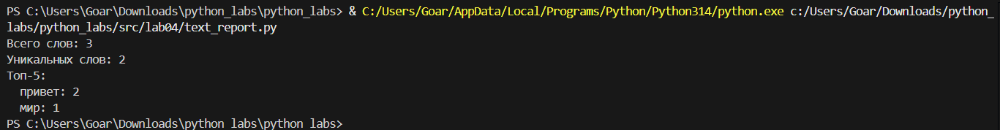

# Лабораторная работа 5 — JSON и конвертации
## Задание A
# JSON ↔ CSV
[json_csv.py](src/lab05/json_csv.py)

• **json_to_csv(json_path, csv_path)**  
  Конвертирует JSON-файл в CSV формат.
  Объединение ключей → столбцы

• **csv_to_json(csv_path, json_path)**  
  Конвертирует CSV-файл в JSON формат.
  Каждая строка → словарь
 
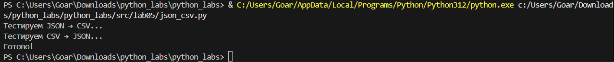
## Результат
### входные данные 
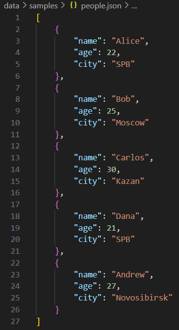

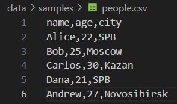

### выходные данные
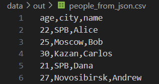

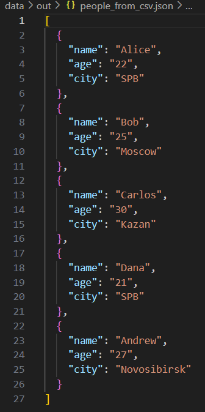

## Задание B
# CSV → XLSX
[csv_xlsx.py](src/lab05/csv_xlsx.py)

## Установка зависимостей:
```pip install openpyxl```

• **csv_to_xlsx(csv_path, xlsx_path)**  
  Конвертирует CSV-файл в XLSX формат.

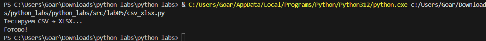

## Результат
### входные данные 
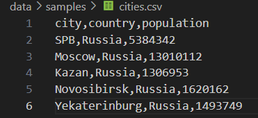

### выходные данные
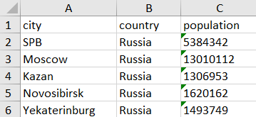


# Лабораторная работа 6 — CLI‑утилиты с argparse
- [cli_text.py](src/lab06/cli_text.py)

- [cli_convert.py](src/lab06/cli_convert.py)

## Результат
- **cli_text**


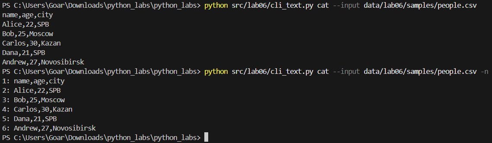
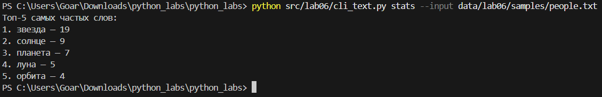

- **cli_convert**

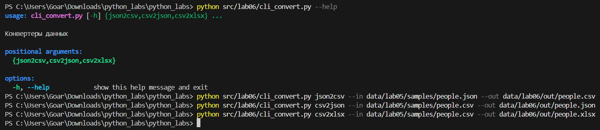

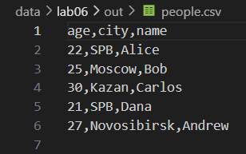

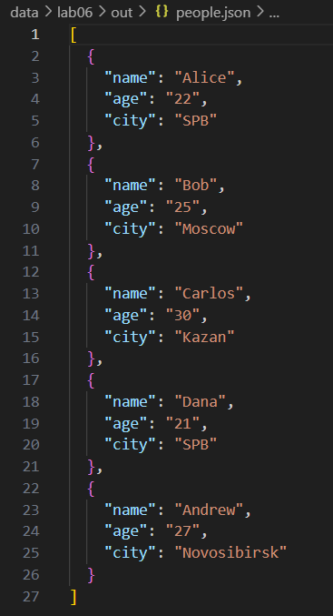

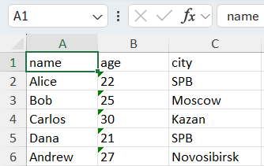

# Лабораторная работа 7 — Тестирование: pytest + стиль

- [test_text.py](src/lab07/test_text.py)

- [json_csv.py](src/lab07/json_csv.py)

## pyproject.toml
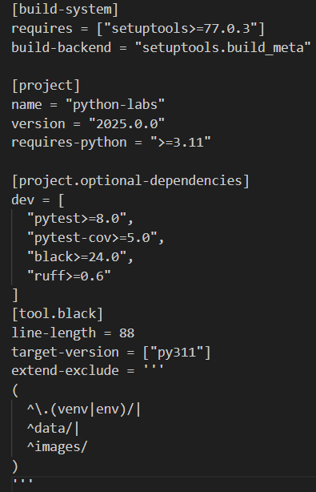

## Вывод тестов
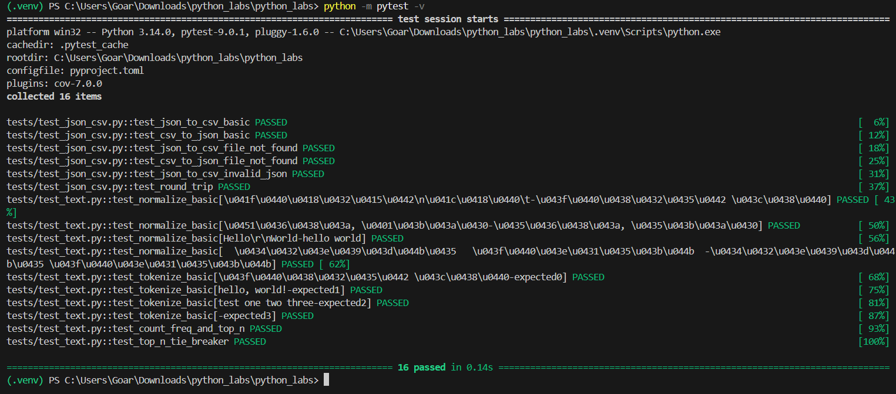

## Результаты покрытия
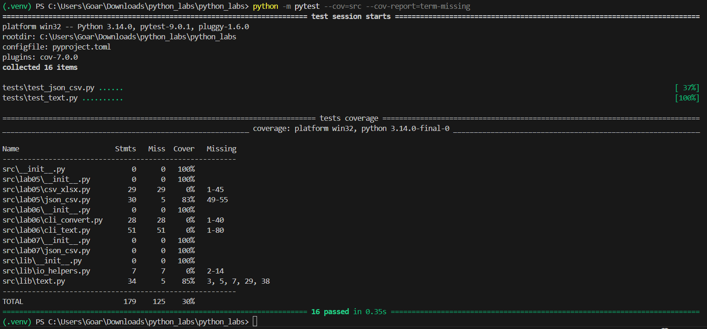

## Результаты проверки стиля black
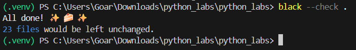

# Лабораторная работа 8 – ООП в Python: @dataclass Student, методы и сериализация
- [models.py](src/lab08/models.py)
    ### Класс данных для представления студента с использованием @dataclass.
    


- [serialize.py](src/lab08/serialize.py)
    ### Сериализует список студентов в JSON файл.
    
    #### students_input.json
    
    #### students_output.json
    

# Лабораторная работа 9 — «База данных» на CSV
#### Класс Group с операциями CRUD для работы с CSV
- [group.py](src/lab09/group.py)
#### CSV файл со студентами
- [students.csv](data/lab09/students.csv)
### Пример использования
```
if __name__ == "__main__":
    group = Group("data/lab09/students.csv")

    group.add(Student(fio="Васильев Василий Васильевич", birthdate="2006.12.16", group="BIVT-24", gpa=4.6))
    group.add(Student(fio="Ильин Илья Ильич", birthdate="2007.05.15", group="BIVT-25", gpa=4.7))
    group.add(Student(fio="Алексеев Алексей Алексеевич", birthdate="2005.01.01", group="BIVT-23", gpa=4.8))
    group.print_with_age()
```
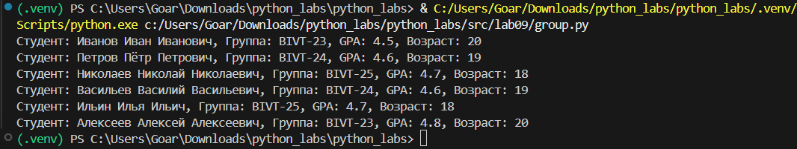
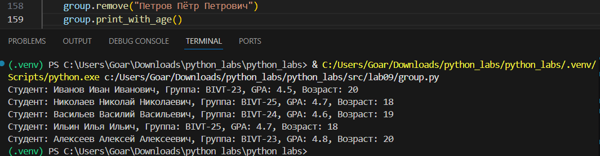
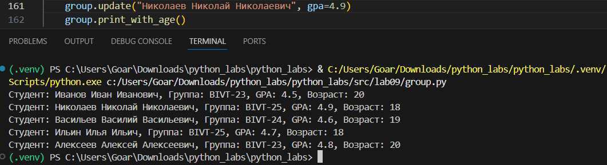
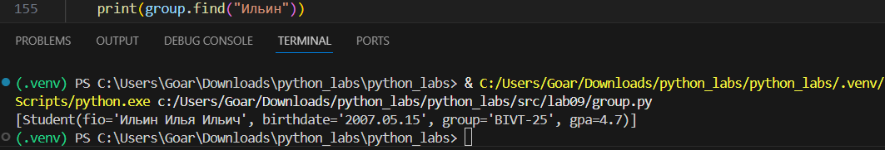