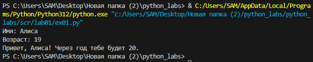
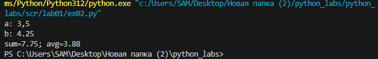
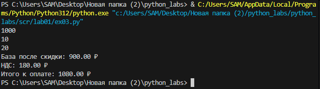
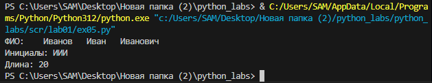

# Лабораторная работа 1
## Задание 1
# Привет и возраст
```
name = input("Имя: ")
age = int(input("Возраст: "))
print(f"Привет, {name}! Через год тебе будет {age + 1}.")
```



## Задание 2
# Сумма и среднее
```
a_ = input("a: ").replace(",", ".")
b_ = input("b: ").replace(",", ".")
a,b = float(a_),float(b_)
s = round(a+b, 2)
a = round((a+b)/2, 2)
print(f"sum={s}; avg={a}")
```


## Задание 3
# Чек: скидка и НДС
```
price = float(input().replace(',', '.'))
discount = float(input().replace(',', '.'))
vat = float(input().replace(',', '.'))
base = price * (1 - discount/100)
vat_amount = base * (vat/100)
total = base + vat_amount
print(f"База после скидки: {base:.2f} ₽")
print(f"НДС: {vat_amount:.2f} ₽")
print(f"Итого к оплате: {total:.2f} ₽")
```


## Задание 4
# Минуты → ЧЧ:ММ
```
m = int(input("Минуты: "))
hour = m // 60
minut = m % 60
print(f"{hour}:{minut:02d}")
```


## Задание 5
# Инициалы и длина строки
```
fio_ = input("ФИО: ")
fio = ' '.join(fio_.split())
inicial = ''.join([x[0].upper() for x in fio.split()])
print("Инициалы:", inicial)
print("Длина:", len(fio))
```


## Задание 6
```
n = int(input())
k_off, k_on = 0,0
for i in range(n):
    s = input().split()
    f = s[-1]
    if f == "True":
        k_off += 1
    else:
        k_on += 1
print(f"{k_off} {k_on}")
```
