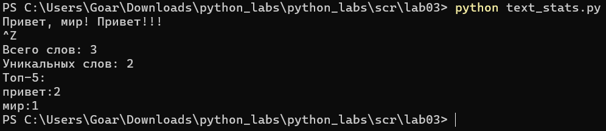

# Лабораторная работа 3

## Задание 1

```
import re
from collections import Counter
def normalize(text: str, *, casefold: bool = True, yo2e: bool = True) -> str:
    text = re.sub(r'\s', ' ', text).strip()
    text = text.casefold()
    text = text.replace('ё', 'е').replace('Ё', 'Е')
    return text

def tokenize(text: str) -> list[str]:
    return re.findall(r'\w+(?:-\w+)*', text)

def count_freq(tokens: list[str]) -> dict[str, int]:
    return dict(Counter(tokens))

def top_n(freq: dict[str, int], n: int = 5) -> list[tuple[str, int]]:
    return sorted(freq.items(), key=lambda x: (-x[1], x[0]))[:n]

print("Тесты normalize")
print(normalize("ПрИвЕт\nМИр\t"))
print(normalize("Ёжик, Ёлка"))

print("\nТесты tokenize")
print(tokenize("привет, мир!"))
print(tokenize("по-настоящему круто"))
print(tokenize("2025 год"))

print("\nТесты count_freq + top_n")
freq = count_freq(["a", "b", "a", "c", "b", "a"])
print(top_n(freq, 2))

print("\nТест тай-брейка")
freq2 = count_freq(["bb", "aa", "bb", "aa", "cc"])
print(top_n(freq2, 2))
```


## Задание 2

```
import sys
import os
# путь к папке lib
current_dir = os.path.dirname(__file__)
lib_path = os.path.join(current_dir, '..', '..', 'lib')
sys.path.append(lib_path)

from text import normalize, top_n, tokenize, count_freq

text = sys.stdin.read()
words = tokenize(normalize(text))
freq = count_freq(words)
top = top_n(freq, 5)

print(f'Всего слов: {len(words)}')
print(f'Уникальных слов: {len(freq)}')
print('Топ-5:')
for word, count in top:
    print(f'{word}:{count}')
```

