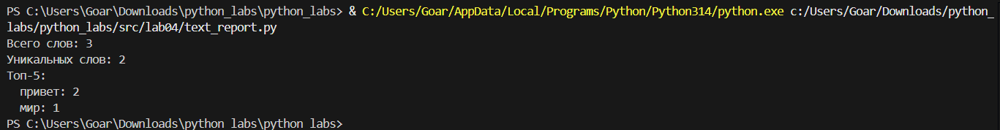

# Лабораторная работа 4 — Файлы
## Задание A

```
import csv
import os
from typing import Iterable, Sequence

def read_text(path: str, encoding: str = "utf-8") -> str:
    with open(path, 'r', encoding=encoding) as file:
        content = file.read()
    return content

def write_csv(rows: Iterable[Sequence], path: str,
              header: tuple[str, ...] | None = None) -> None:
    # Создаем папку если нет
    os.makedirs(os.path.dirname(path), exist_ok=True)
    
    rows = list(rows)
    with open(path, "w", newline="", encoding="utf-8") as f:
        w = csv.writer(f)
        if header is not None:
            w.writerow(header)
        for r in rows:
            w.writerow(r)

if __name__ == "__main__":
    txt = read_text("data/lab04/input.txt")
    write_csv([("word", "count"), ("test", 3)], "data/lab04/check.csv")
```


## Задание B

```
from collections import Counter
from io_txt_csv import read_text, write_csv
import sys
import os

# Добавляем путь к папке src
sys.path.append(os.path.join(os.path.dirname(__file__), '..'))

from lib.text import normalize, tokenize

def frequencies_from_text(text: str) -> dict[str, int]:
    tokens = tokenize(normalize(text))
    return Counter(tokens)

def sorted_word_counts(freq: dict[str, int]) -> list[tuple[str, int]]:
    return sorted(freq.items(), key=lambda kv: (-kv[1], kv[0]))

text = read_text("data/lab04/input.txt", encoding="utf-8")
freq = frequencies_from_text(text)
sorted_counts = sorted_word_counts(freq)

write_csv(sorted_counts, "data/lab04/report.csv", header=("word", "count"))

total_words = sum(freq.values())
unique_words = len(freq)

print(f"Всего слов: {total_words}")
print(f"Уникальных слов: {unique_words}")
print("Топ-5:")
for word, count in sorted_counts[:5]:
    print(f"  {word}: {count}")
```

