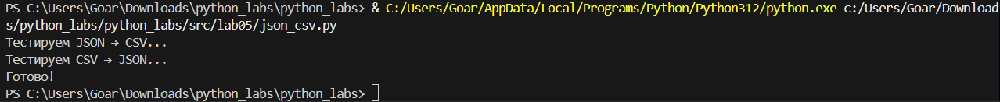
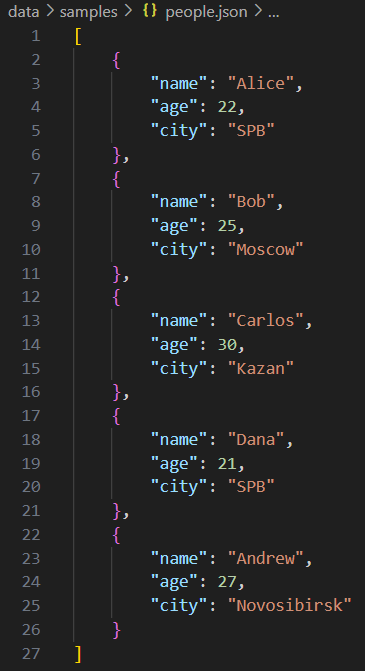
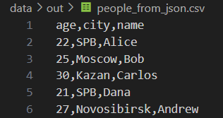
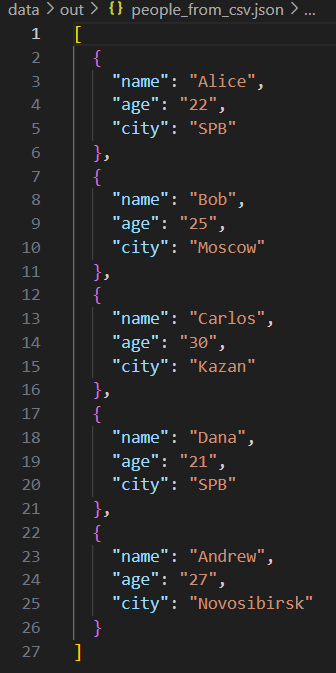
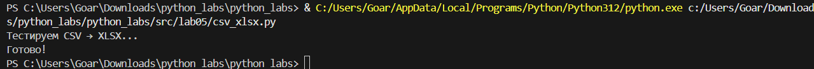
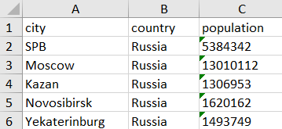

# Лабораторная работа 5 — JSON и конвертации
Задание A

 - JSON ↔ CSV
```
import json
import csv
from pathlib import Path


def json_to_csv(json_path: str, csv_path: str) -> None:
    """Преобразует JSON в CSV"""

    # Читаем JSON
    with open(json_path, encoding="utf-8") as f:
        data = json.load(f)

    # Получаем все ключи
    all_keys = set()
    for item in data:
        all_keys.update(item.keys())
    fieldnames = sorted(all_keys)

    # Создаем папку если нужно
    Path(csv_path).parent.mkdir(parents=True, exist_ok=True)

    # Пишем CSV
    with open(csv_path, "w", newline="", encoding="utf-8") as f:
        writer = csv.DictWriter(f, fieldnames=fieldnames)
        writer.writeheader()

        for item in data:
            row = {field: item.get(field, "") for field in fieldnames}
            writer.writerow(row)


def csv_to_json(csv_path: str, json_path: str) -> None:
    """Преобразует CSV в JSON"""

    # Читаем CSV
    with open(csv_path, encoding="utf-8") as f:
        reader = csv.DictReader(f)
        data = list(reader)

    # Создаем папку если нужно
    Path(json_path).parent.mkdir(parents=True, exist_ok=True)

    # Пишем JSON
    with open(json_path, "w", encoding="utf-8") as f:
        json.dump(data, f, ensure_ascii=False, indent=2)


if __name__ == "__main__":
    print("Тестируем JSON → CSV...")
    json_to_csv("data/lab05/samples/people.json", "data/lab05/out/people_from_json.csv")

    print("Тестируем CSV → JSON...")
    csv_to_json("data/lab05/samples/people.csv", "data/lab05/out/people_from_csv.json")

    print("Готово!")

```

• **json_to_csv(json_path, csv_path)**  
  Конвертирует JSON-файл в CSV формат.
  Объединение ключей → столбцы

• **csv_to_json(csv_path, json_path)**  
  Конвертирует CSV-файл в JSON формат.
  Каждая строка → словарь
 

## Результат

### входные данные 



### выходные данные




## Задание B
 - CSV → XLSX
```
import csv
from openpyxl import Workbook
from pathlib import Path


def csv_to_xlsx(csv_path: str, xlsx_path: str) -> None:
    """Конвертирует CSV в XLSX"""

    # Читаем CSV
    with open(csv_path, encoding="utf-8") as f:
        reader = csv.reader(f)
        rows = list(reader)

    # Создаем XLSX
    wb = Workbook()
    ws = wb.active
    ws.title = "Sheet1"

    # Записываем данные
    for row in rows:
        ws.append(row)

    # Автоширина колонок
    for column in ws.columns:
        max_length = 0
        for cell in column:
            try:
                if len(str(cell.value)) > max_length:
                    max_length = len(str(cell.value))
            except:
                pass
        # Минимум 8 символов
        width = max(max_length + 2, 10)
        ws.column_dimensions[column[0].column_letter].width = width

    # Сохраняем
    Path(xlsx_path).parent.mkdir(parents=True, exist_ok=True)
    wb.save(xlsx_path)


if __name__ == "__main__":
    print("Тестируем CSV → XLSX...")
    csv_to_xlsx("data/lab05/samples/people.csv", "data/lab05/out/people.xlsx")
    csv_to_xlsx("data/lab05/samples/cities.csv", "data/lab05/out/cities_from_csv.xlsx")
    print("Готово!")

```

Установка зависимостей:
```pip install openpyxl```

• **csv_to_xlsx(csv_path, xlsx_path)**  
  Конвертирует CSV-файл в XLSX формат.



## Результат
### входные данные 


### выходные данные
