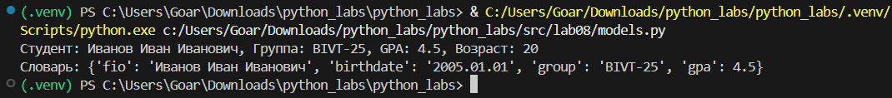
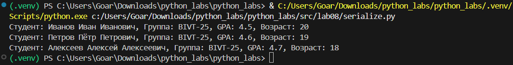
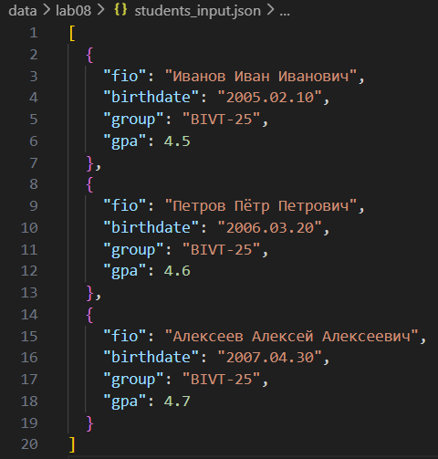
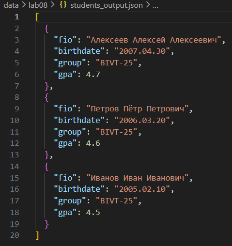

# Лабораторная работа 8 – ООП в Python: @dataclass Student, методы и сериализация

```
from dataclasses import dataclass
from datetime import datetime, date


@dataclass
class Student:
    fio: str
    birthdate: str
    group: str
    gpa: float
    
    def __post_init__(self):
        try:
            datetime.strptime(self.birthdate.replace('.', '-'), "%Y-%m-%d")
        except ValueError:
            raise ValueError(f"Некорректный формат даты: {self.birthdate}")
        
        if not 0 <= self.gpa <= 5:
            raise ValueError(f"GPA должен быть от 0 до 5")
    
    def age(self):
        birth_date = datetime.strptime(self.birthdate.replace('.', '-'), "%Y-%m-%d").date()
        today = date.today()
        age = today.year - birth_date.year
        if (today.month, today.day) < (birth_date.month, birth_date.day):
            age -= 1
        return age
    
    def to_dict(self):
        return {
            "fio": self.fio,
            "birthdate": self.birthdate,
            "group": self.group,
            "gpa": self.gpa
        }
    
    @classmethod
    def from_dict(cls, d):
        return cls(
            fio=d["fio"],
            birthdate=d["birthdate"],
            group=d["group"],
            gpa=d["gpa"]
        )
    
    def __str__(self):
        return f"Студент: {self.fio}, Группа: {self.group}, GPA: {self.gpa}, Возраст: {self.age()}"


if __name__ == "__main__":
    # Тестовый запуск
    test = Student("Иванов Иван Иванович", "2005.01.01", "BIVT-25", 4.5)
    print(test)
    print(f"Словарь: {test.to_dict()}")
```


Класс данных для представления студента с использованием @dataclass.




```
import json
import sys
import os

# Решаем проблему импорта
current_dir = os.path.dirname(os.path.abspath(__file__))
if current_dir not in sys.path:
    sys.path.append(current_dir)

try:
    from models import Student
except ImportError:
    # Пробуем относительный импорт
    from .models import Student


def students_to_json(students, path):
    students = sorted(students, key=lambda s: s.gpa, reverse=True)
    data = [s.to_dict() for s in students]
    with open(path, 'w', encoding='utf-8') as f:
        json.dump(data, f, ensure_ascii=False, indent=2)


def students_from_json(path):
    with open(path, 'r', encoding='utf-8') as f:
        data = json.load(f)
    return [Student.from_dict(item) for item in data]


if __name__ == "__main__":
    # Используй абсолютный путь
    import os
    current_dir = os.path.dirname(__file__)
    input_path = os.path.join(current_dir, "..", "..", "data", "lab08", "students_input.json")
    
    students = students_from_json(input_path)
    
    for student in students:
        print(student)
    
    output_path = os.path.join(current_dir, "..", "..", "data", "lab08", "students_output.json")
    students_to_json(students, output_path)
```

Сериализует список студентов в JSON файл.
    
    
**students_input.json**
    

**students_output.json**
    