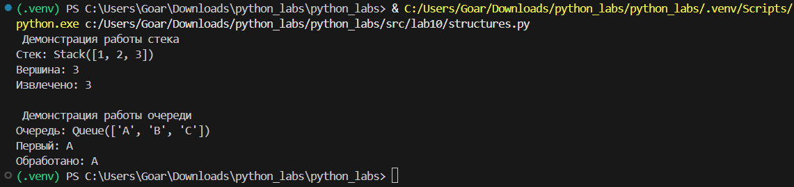
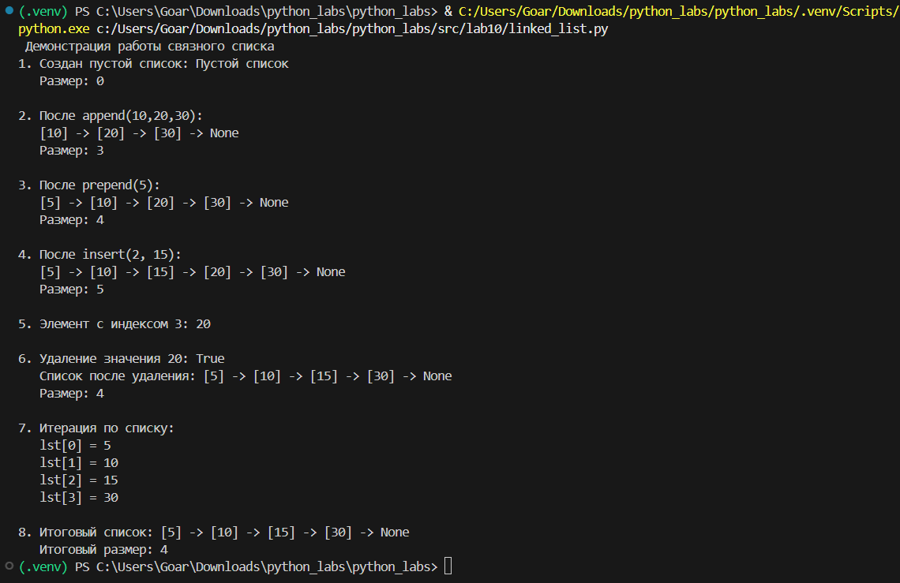

# Лабораторная работа 10 — Структуры данных: Stack, Queue, Linked List и бенчмарки
### Теоретическая часть

📚 **Стек (Stack)**

 - *Принцип:* LIFO (Last In, First Out) — "последний вошел, первый вышел"

 - *Основные операции:*

     - push(item) - добавить на вершину O(1)

     - pop() - снять с вершины O(1)

     - peek() - посмотреть вершину O(1)

 - *Применение:* история действий (undo/redo), проверка скобок, DFS

📚 **Очередь (Queue)**

 - *Принцип:* FIFO (First In, First Out) — "первый вошел, первый вышел"

 - *Основные операции:*

     - enqueue(item) - добавить в конец O(1)

     - dequeue() - взять из начала O(1)

     - peek() - посмотреть начало O(1)

 - *Применение:* BFS, обработка задач, буферы

📚 **Односвязный список (Singly Linked List)**

 - *Структура:* узлы с данными и ссылками

 - *Преимущества:*

     - Вставка/удаление в начале O(1)

     - Динамический размер

 - *Недостатки:*

     - Доступ по индексу O(n)

     - Больше памяти на узел

### Код реализации
**Stack и Queue**

```
# Реализация Stack и Queue
from collections import deque

class Stack:
    
    def __init__(self):
        self._data = []
    
    def push(self, item):
        self._data.append(item)
    
    def pop(self):
        if not self._data:
            raise IndexError("Стек пуст")
        return self._data.pop()
    
    def peek(self):
        return self._data[-1] if self._data else None
    
    def is_empty(self):
        return len(self._data) == 0
    
    def __len__(self):
        return len(self._data)
    
    def __str__(self):
        return f"Stack({self._data})"


class Queue:
    def __init__(self):
        self._data = deque()
    
    def enqueue(self, item):
        self._data.append(item)
    
    def dequeue(self):
        if not self._data:
            raise IndexError("Очередь пуста")
        return self._data.popleft()
    
    def peek(self):
        return self._data[0] if self._data else None
    
    def is_empty(self):
        return len(self._data) == 0
    
    def __len__(self):
        return len(self._data)
    
    def __str__(self):
        return f"Queue({list(self._data)})"
    
if __name__ == "__main__":
    print(" Демонстрация работы стека ")
    stack = Stack()
    stack.push(1)
    stack.push(2)
    stack.push(3)
    print(f"Стек: {stack}")
    print(f"Вершина: {stack.peek()}")
    print(f"Извлечено: {stack.pop()}")
    
    print("\n Демонстрация работы очереди ")
    queue = Queue()
    queue.enqueue('A')
    queue.enqueue('B')
    queue.enqueue('C')
    print(f"Очередь: {queue}")
    print(f"Первый: {queue.peek()}")
    print(f"Обработано: {queue.dequeue()}")
```



**SinglyLinkedList**

```
# Реализация односвязного списка

class Node:
    def __init__(self, value, next=None):
        self.value = value
        self.next = next
    
    def __str__(self):
        return f"[{self.value}]"


class SinglyLinkedList:
    
    def __init__(self):
        self.head = None
        self.tail = None  # Для O(1) добавления в конец
        self._size = 0
    
    def append(self, value):
        new_node = Node(value)
        if not self.head:
            self.head = new_node
            self.tail = new_node
        else:
            self.tail.next = new_node
            self.tail = new_node
        self._size += 1
    
    def prepend(self, value):
        new_node = Node(value, self.head)
        self.head = new_node
        if not self.tail:
            self.tail = new_node
        self._size += 1
    
    def insert(self, idx, value):
        if idx < 0 or idx > self._size:
            raise IndexError(f"Индекс {idx} вне диапазона")
        
        if idx == 0:
            self.prepend(value)
        elif idx == self._size:
            self.append(value)
        else:
            current = self.head
            for _ in range(idx - 1):
                current = current.next
            new_node = Node(value, current.next)
            current.next = new_node
            self._size += 1
    
    def remove(self, value):
        if not self.head:
            return False
        
        if self.head.value == value:
            self.head = self.head.next
            if not self.head:
                self.tail = None
            self._size -= 1
            return True
        
        current = self.head
        while current.next:
            if current.next.value == value:
                if current.next == self.tail:
                    self.tail = current
                current.next = current.next.next
                self._size -= 1
                return True
            current = current.next
        
        return False
    
    def get(self, idx):
        if idx < 0 or idx >= self._size:
            raise IndexError(f"Индекс {idx} вне диапазона")
        
        current = self.head
        for _ in range(idx):
            current = current.next
        return current.value
    
    def __iter__(self):
        current = self.head
        while current:
            yield current.value
            current = current.next
    
    def __len__(self):
        return self._size
    
    def __str__(self):
        nodes = []
        current = self.head
        while current:
            nodes.append(str(current))
            current = current.next
        return " -> ".join(nodes) + " -> None" if nodes else "Пустой список"
    
    
if __name__ == "__main__":
    print(" Демонстрация работы связного списка ")
    
    lst = SinglyLinkedList()
    print(f"1. Создан пустой список: {lst}")
    print(f"   Размер: {len(lst)}\n")
    
    # Добавление в конец
    lst.append(10)
    lst.append(20)
    lst.append(30)
    print(f"2. После append(10,20,30):")
    print(f"   {lst}")
    print(f"   Размер: {len(lst)}\n")
    
    # Добавление в начало
    lst.prepend(5)
    print(f"3. После prepend(5):")
    print(f"   {lst}")
    print(f"   Размер: {len(lst)}\n")
    
    # Вставка по индексу
    lst.insert(2, 15)
    print(f"4. После insert(2, 15):")
    print(f"   {lst}")
    print(f"   Размер: {len(lst)}\n")
    
    # Получение элемента
    print(f"5. Элемент с индексом 3: {lst.get(3)}\n")
    
    # Удаление
    print(f"6. Удаление значения 20: {lst.remove(20)}")
    print(f"   Список после удаления: {lst}")
    print(f"   Размер: {len(lst)}\n")
    
    # Итерация
    print("7. Итерация по списку:")
    for i, val in enumerate(lst):
        print(f"   lst[{i}] = {val}")
    
    print(f"\n8. Итоговый список: {lst}")
    print(f"   Итоговый размер: {len(lst)}")

```

